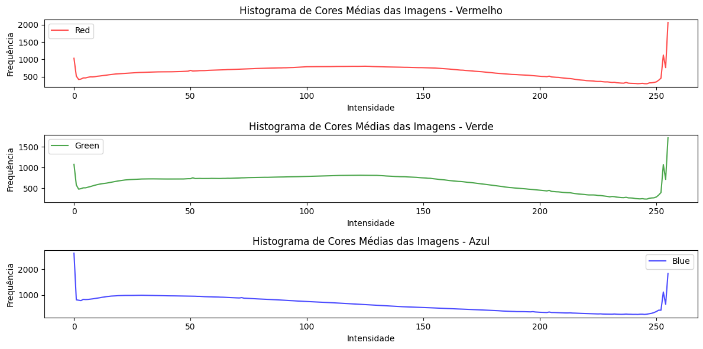
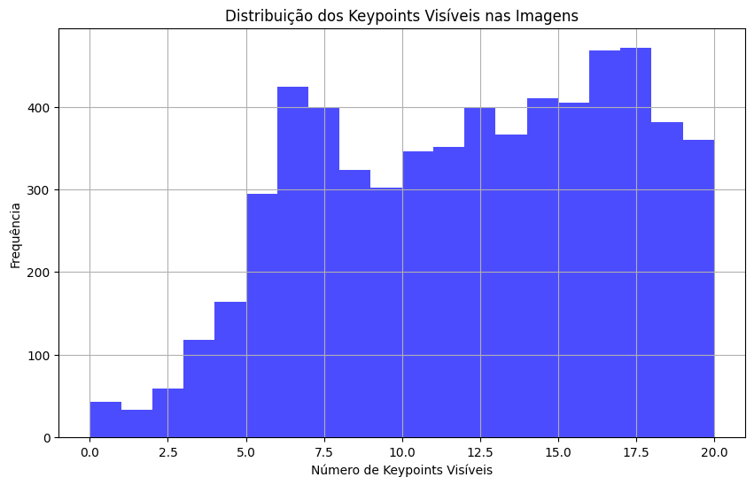

# Atividade do Pose Estimation

Utilizando do dataset do Animal Pose (mais de 6000 instâncias e mais de 4000 imagens), com as seguintes categorias:

- Categoria 1: Gato;
- Categoria 2: Cachorro;
- Categoria 3: Cavalo;
- Categoria 4: Ovelha;
- Categoria 5: Vaca;
  
O maior foco desta atividade será no rótulo "Vaca". Partindo disso, foi feito uma análise exploratória focando nos pontos de distribuição das cores; distribuição do brilho; distribuição dos keypoints; distribuição do tamanho das imagens; distribuição das categorias no dataset.

**Histograma das Cores:**

É possível inferir com o gráfico que a maioria dos pixels dentre as imagens do dataset ocupam uma maior frequência na ponta direita do gráfico, ou seja, pixels de alta intensidade.

**Distribuição do Tamanho das Imagens**

A partir do gráfico de barras é possível inferir que a maioria das imagens possuem um achatamento na largura maior que altura, o que, consequentemente, resulta em imagens em sua maioria um retângulo e não um quadrado perfeito.

**Comparativo de Brilho nas Imagens**

Diante do gráfico, é possível inferir que a distribuição do brilho se assemelha a uma distribuição normal, mantendo a maioria das imagens na frequência entre [100, 150].

**Distribuição dos Keypoints**

Com a distribuição dos keypoints é possível inferir um alto grau de confiança com os keypoints na faixa de [12, 17], sendo estes concentrados na parte superior dos animais.

**Distribuição das Categorias no Dataset**

Distribuição das 5 categorias diante do dataset de mais de 4000 imagens e mais de 6000 instâncias. É possível inferir que o conjunto de imagens com categoria "vaca" é a menor do dataset, valor de "842", porém é importante ficar atento, pois, posteriormente haverá uma limpeza nos dados de modo a tirar ruídos.

**Separação do Conjunto dos Bovinos**

Antes da limpeza existia "842" bovinos, e logo em seguida, após a separação das categorias e a limpeza dos dados, no final ficou "534". Para atingir tal façanha, foi feito um processo de separação usando o dicionário "keypoints" com suas chaves "images" e "annotations".

**Filtros Aplicados (Processamento)**

Diferentes filtros e técnicas de pré-processamento de imagens aplicados a um conjunto de imagens usando a biblioteca Pillow no Python. Vamos passar pelas etapas de aplicação de filtros para redução de ruído, melhoria de nitidez, suavização e ajuste de contraste.

1. Filtros Utilizados:
- Filtro Gaussiano: Reduz o ruído da imagem aplicando um desfoque gaussiano.
- Filtro de Nitidez: Aumenta a nitidez da imagem realçando as bordas.
- Filtro de Mediana: Reduz o ruído impulsivo (ou "sal e pimenta") na imagem.
- Ajuste de Contraste: Aumenta o contraste da imagem, tornando as diferenças entre os tons mais distintas.

2. Passo a Passo do Pré-Processamento:

- Carregamento da Imagem Original:

A primeira imagem é carregada para visualização.

- Filtro Gaussiano:

Aplica-se o filtro gaussiano para redução de ruído.
Exibe-se a imagem resultante após a aplicação do filtro.

- Filtro de Nitidez:

Aplica-se o filtro de nitidez para melhorar a definição de bordas.
Exibe-se a imagem resultante após a aplicação do filtro.

- Filtro de Mediana:

Aplica-se o filtro de mediana para reduzir o ruído impulsivo.
Exibe-se a imagem resultante após a aplicação do filtro.

- Ajuste de Contraste:

Realiza-se o ajuste de contraste na imagem para aumentar a diferença entre os tons. Exibe-se a imagem resultante após o ajuste de contraste.

- Normalização:

Foi realizado a normalização dos pixels para [0, 1] dividindo-os por 255.

Ademais fluxo em diagrama:

Exemplo de transformação está na seção "Processamento de Filtros Aplicados" no notebook "animal_pose_estimation.ipynb"

**Resultados Pós-Processamento**

Apresentação por visualização gráfica, por meio de gráficos simples de distribuição de cores e brilho. Logo abaixo:

**Distribuição de Brilho:**

A distribuição de brilho continou quase como uma distribuição normal dentre todos os canais, demonstrando que sua intensidade não se afetou após os filtros aplicados.

**Histograma de Cores:**

A distribuição de cores saiu das pontas a concentração e ficou concentrada no meio, aparentemente causando uma distribuição mais equilibrada.

**Conclusão**

Principais Aprendizados:

- A distribuição de cores e brilho oferece insights valiosos sobre as características das imagens no dataset.

- A análise dos keypoints fornece informações cruciais sobre a localização e a concentração dos pontos de interesse nas imagens.
  
- A normalização e a padronização dos dados são etapas essenciais para preparar os dados para modelos de machine learning.
  
- Os filtros de pré-processamento podem melhorar significativamente a qualidade das imagens, tornando-as mais adequadas para análise e modelagem.

Limitações de Trabalho:

- O dataset pode conter imagens de baixa qualidade ou ruídos que afetam a precisão da análise.
  
- Algumas categorias podem estar sub-representadas no dataset, o que pode levar a desequilíbrios nos dados.
  
- As técnicas de pré-processamento podem introduzir artefatos nas imagens, exigindo ajustes e otimizações adicionais.
  
Sugestões de trabalhos futuros:

- Explorar técnicas avançadas de pré-processamento de imagem para melhorar ainda mais a qualidade das imagens.
  
- Investigar métodos de aumento de dados para ampliar o dataset, especialmente para categorias sub-representadas.
  
- Utilizar redes neurais convolucionais (CNNs) para realizar tarefas de reconhecimento de pose com base nos keypoints identificados.
  
- Desenvolver um modelo de classificação para identificar automaticamente diferentes categorias de animais nas imagens.
  
- Realizar uma análise mais aprofundada das características específicas de cada categoria de animal para entender melhor suas diferenças e similaridades.

